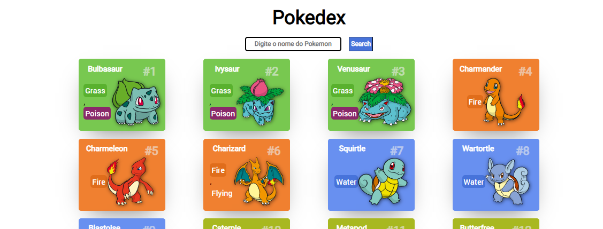

# Simple Pokedex 🤳

Este projeto foi desenvolvido como parte do aprendizado em JavaScript, com foco no consumo de APIs e na criação de uma aplicação simples e funcional. A ideia principal foi criar uma Pokédex, onde os usuários podem visualizar informações sobre diferentes Pokémon, utilizando dados fornecidos por uma API pública.

 📢 Projeto limitado a 1º Geração de Pokemons!

## Tecnologias Utilizadas 📱

- 📌 **HTML5**: Estruturação do conteúdo da aplicação.
- 📌 **CSS3**: Estilização e layout responsivo.
- 📌 **JavaScript**: Lógica de programação, manipulação do DOM e consumo de APIs.
- 📌 **Fetch API**: Para realizar requisições HTTP e obter dados da [PokéAPI](https://pokeapi.co/).

## Abordagem

1. 🔗 **Consumo de API**: Utilizamos a Fetch API para buscar informações diretamente da PokéAPI, garantindo que os dados estejam sempre atualizados.
2. 🛠 **Manipulação do DOM**: Implementamos a exibição dinâmica das informações dos Pokémon na página, utilizando JavaScript puro.
3. ♦ **Design Simples**: O foco foi na funcionalidade e na clareza, com um layout minimalista para facilitar a navegação e a compreensão do código.
4. ⚙ **Respanssividade**: De maneira masi simples pude também exporar conceitos de Respanssividade, voltados para multiplas telas e dimenssões, podenod arriscar nas **Media Querys** .

## O que foi aprendido 📚

- Como consumir APIs de maneira simples utilizando a Fetch API.
- Manipulação de elementos do DOM para criar interfaces dinâmicas.
- Estruturação de projetos JavaScript para facilitar a manutenção e a escalabilidade.
- A importância de trabalhar com dados externos e integrá-los em aplicações web.

## Referências 📃

- [PokéAPI](https://pokeapi.co/): API utilizada para obter os dados dos Pokémon.
- [Documentação Fetch API - MDN](https://developer.mozilla.org/en-US/docs/Web/API/Fetch_API): Guia para realizar requisições HTTP com JavaScript.

Este projeto foi uma excelente oportunidade para consolidar os conhecimentos em JavaScript e no consumo de APIs, além de reforçar boas práticas de desenvolvimento web.

### Desenvolvido por : [José Gonçalves](www.linkedin.com/in/jgoncalvessf) 💻
