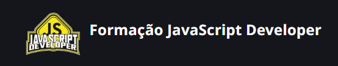

# Formação JavaScript Developer

O objetivo deste projeto foi demonstrar minhas habilidades em desenvolvimento web, criando uma interface moderna e interativa.

Este é o meu portfólio desenvolvido utilizando **JavaScript, CSS e HTML**, como parte da formação na **DIO**.

## 📌 Meu Portfólio

## 🚀 Tecnologias Utilizadas

- **HTML5** - Estrutura semântica e acessível
- **CSS3** - Layout moderno e responsivo
- **JavaScript** - Interatividade dinâmica
- **[Bibliotecas/Frameworks]** - Caso tenha utilizado alguma

## 🔍 Funcionalidades

- Apresentação pessoal e projetos desenvolvidos
- Design responsivo e acessível
- Animações Simples e suaves
- Links para redes sociais e contato

## 📢Créditos

Link referente a interface no figma [Desgner Figma](https://www.figma.com/design/g6zA6klLrCWZAp76tzoVJZ/Portfolio---EDUCATION?node-id=0-1&p=f&t=DHUMvRiIoyFlnl43-0)
Desenvolvido por [José Gonçalves](www.linkedin.com/in/jgoncalvessf) 👻
